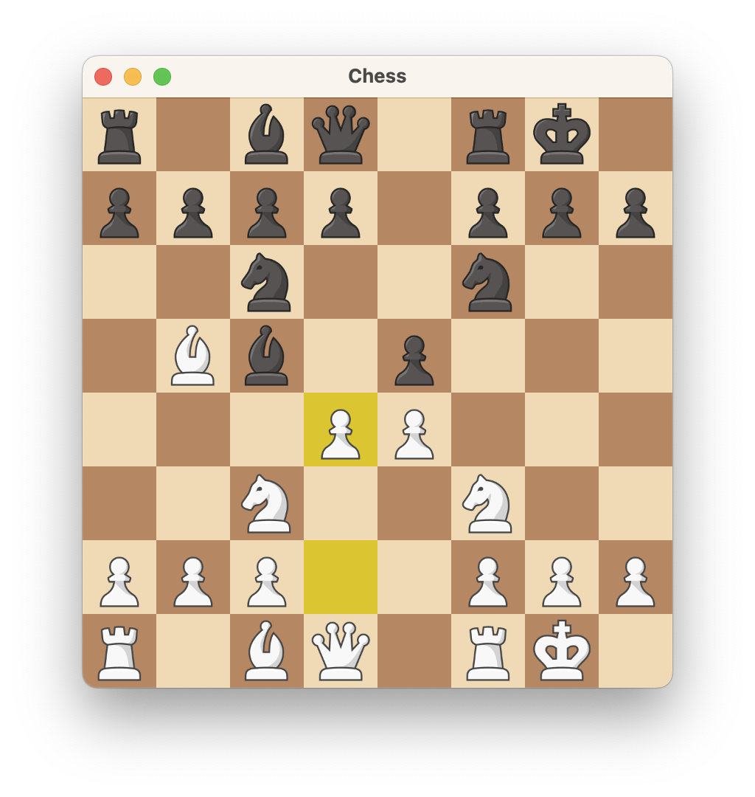
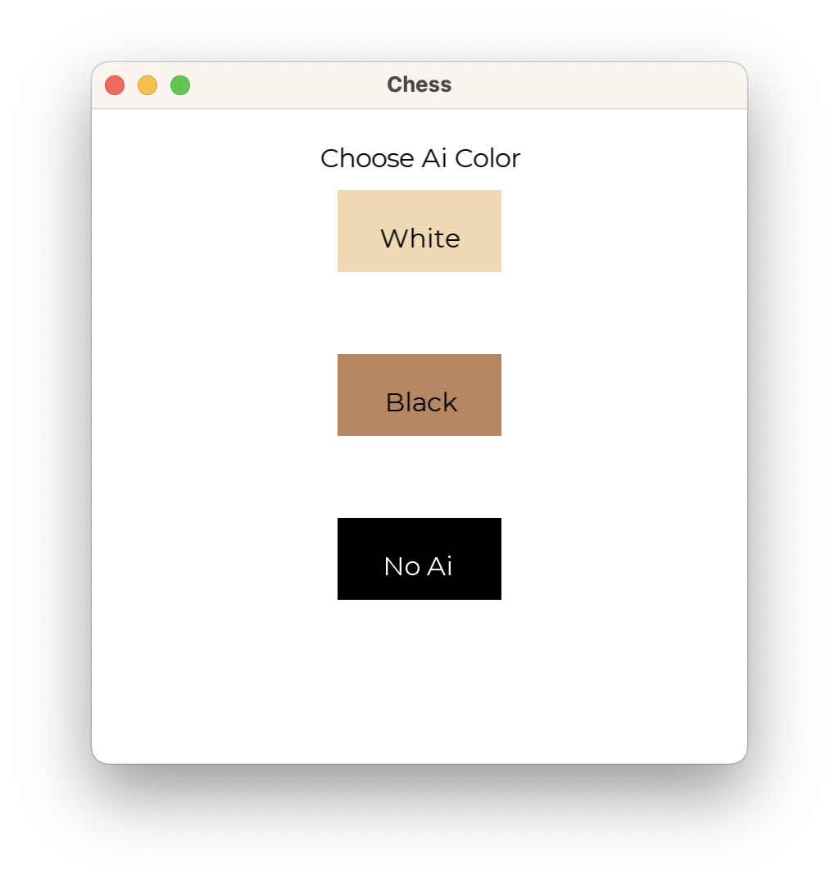
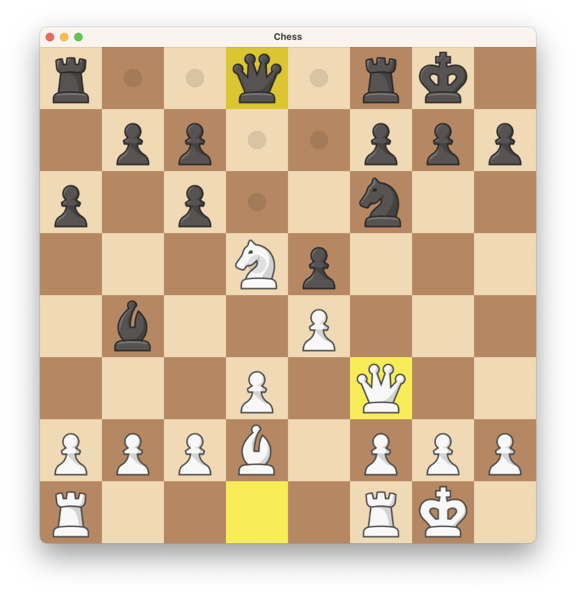

<!-- PROJECT LOGO -->
<br />
<div align="center">
  <a href="https://github.com/Mihir-A/Chess-AI">
    
  </a>

<h3 align="center">Chess Ai</h3>

  <p align="center">
    A chess game implemented using C++ and SFML, with an optional AI
  </p>
</div>

<div align="center">
  
</div>


<!-- USAGE EXAMPLES -->
## Usage
* Select if you want to play an AI or a 2 player game
* Moves can be done by dragging a piece or clicking on a piece and then clicking the new square
* Press R to resset game or D to undo a move
* Toggle AI with A

## Features
* Support for castling and auto promotion to queen
* AI by default looks 4 moves into the future
* AI uses minimax with alpha-beta prunning
* Ai uses piece value and piece position to rank moves


<!-- GETTING STARTED -->
## Building from scratch
  
### Prerequisites

* C++ compiler with c++17 support (VS 20+ or gcc recomened)
  
### Installation

1. Download [SFML](https://www.sfml-dev.org/download/sfml/2.5.1/)
2. Clone the repo
   ```sh
   git clone https://github.com/Mihir-A/Chess-AI.git
   cd Chess-AI
   ```
3. Add SFML to lib and include folders
4. Build using Make or the Visual Studio Solution
   ```sh
   make all
   ```

## Screenshots
<p float="left">
  
  
</p>


<!-- LICENSE -->
## License

Distributed under the MIT License. See `LICENSE.txt` for more information.


<!-- CONTACT -->
## Contact

mihiranan@gmail.com

Project Link: [https://github.com/Mihir-A/Chess-AI](https://github.com/Mihir-A/Chess-AI)


<!-- ACKNOWLEDGMENTS -->
## Acknowledgments
* [Chess.com](Chess.com) used for Neo pieces
* [Chess-AI](https://github.com/SebLague/Chess-AI/blob/d0832f8f1d32ddfb95525d1f1e5b772a367f272e/Assets/Scripts/Core/PieceSquareTable.cs#L4) Used for Piece square tables
* [Readme Template](https://github.com/othneildrew/Best-README-Template)

<p align="right">(<a href="#readme-top">back to top</a>)</p>


<!-- MARKDOWN LINKS & IMAGES -->
<!-- https://www.markdownguide.org/basic-syntax/#reference-style-links -->
[contributors-shield]: https://img.shields.io/github/contributors/Mihir-A/Chess-AI.svg?style=for-the-badge
[contributors-url]: https://github.com/Mihir-A/Chess-AI/graphs/contributors
[forks-shield]: https://img.shields.io/github/forks/Mihir-A/Chess-AI.svg?style=for-the-badge
[forks-url]: https://github.com/Mihir-A/Chess-AI/network/members
[stars-shield]: https://img.shields.io/github/stars/Mihir-A/Chess-AI.svg?style=for-the-badge
[stars-url]: https://github.com/Mihir-A/Chess-AI/stargazers
[issues-shield]: https://img.shields.io/github/issues/Mihir-A/Chess-AI.svg?style=for-the-badge
[issues-url]: https://github.com/Mihir-A/Chess-AI/issues
[license-shield]: https://img.shields.io/github/license/Mihir-A/Chess-AI.svg?style=for-the-badge
[license-url]: https://github.com/Mihir-A/Chess-AI/blob/master/LICENSE.txt
[linkedin-shield]: https://img.shields.io/badge/-LinkedIn-black.svg?style=for-the-badge&logo=linkedin&colorB=555
[linkedin-url]: https://linkedin.com/in/linkedin_username
[product-screenshot]: images/screenshot.png
